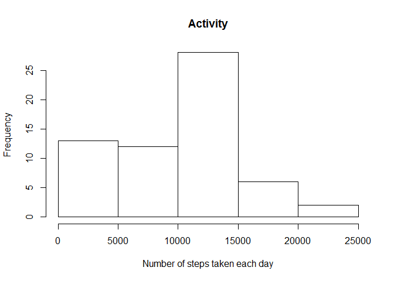
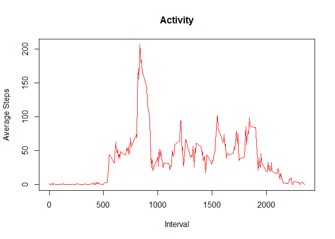
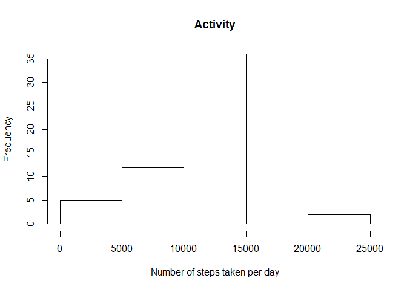
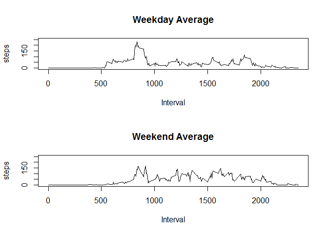

# Project 1
Nate Mosley  
March 20, 2017  

#This is the markdown document for Reproducible Research - Project 1.

##Loading and preprocessing the data

```r
tempfile <-"data.zip"
    if(!file.exists(tempfile)){
      fileUrl <- "https://d396qusza40orc.cloudfront.net/repdata%2Fdata%2Factivity.zip"  
      download.file(fileUrl,tempfile)  
    }
if(!file.exists("activity.csv")){
      unzip(tempfile)
}
df<-read.csv("activity.csv", head=TRUE)
df$date<-as.Date(as.character(df$date),format="%Y-%m-%d")
```

##What is mean total number of steps taken per day?
#### This histogram shows the total number of steps taken per day  

```r
agg<-aggregate(df$steps, by=list(df$date),FUN=sum,na.rm=TRUE)
hist(agg$x, main = "Activity",xlab="Number of steps taken each day")
```

<!-- -->

#### The mean total number of steps per day is:

```r
mean(agg$x, na.rm=TRUE)
```

```
## [1] 9354.23
```
#### The median total number of steps per day is:

```r
median(agg$x, na.rm=TRUE)
```

```
## [1] 10395
```

###What is the average daily activity pattern?

```r
agg2<-aggregate(df$steps, by=list(df$interval),FUN=mean, na.rm=TRUE)
colnames(agg2)<-c("interval","steps")
plot(agg2$interval, agg2$steps, type="l",col="red", main="Activity",xlab="Interval",ylab="Average Steps")
```

<!-- -->

####The maximum number of steps taken per interval is:

```r
subset(agg2,agg2$steps==max(agg2$steps))
```

```
##     interval    steps
## 104      835 206.1698
```

##Imputing missing values

####How many missing values are in the dataset?

```r
nrow(subset(df,is.na(df$steps)==TRUE))
```

```
## [1] 2304
```

####Fill the missing values with mean of the same interval
####Create a new dataset that is equal to the original dataset but with the missing data filled in

```r
getIntervalValue<-function(interval){
  IV<-NULL
  IV<-agg2[agg2$interval==interval,]$steps
  return(IV)
}


df.replaced.na<-df
for(i in 1:nrow(df.replaced.na)){
  if(is.na(df.replaced.na[i,]$steps)){
    df.replaced.na[i,]$steps<-getIntervalValue(df.replaced.na[i,]$interval)
  }
}
```

####Make a histogram from the new data

```r
agg3<-aggregate(df.replaced.na$steps, by=list(df.replaced.na$date),FUN=sum,na.rm=TRUE)
hist(agg3$x, main="Activity",xlab="Number of steps taken per day")
```

<!-- -->

####The mean number of steps is:

```r
mean(agg3$x)
```

```
## [1] 10766.19
```

####The median number of steps is:

```r
median(agg3$x)
```

```
## [1] 10766.19
```

###Are there differences in activity patterns between weekdays and weekends?

```r
library(timeDate)
df.replaced.na$wkday<-factor(isWeekday(df.replaced.na$date, wday=1:5), levels = c("FALSE","TRUE"), labels=c("weekend","weekday"))
df.wkday<-subset(df.replaced.na,df.replaced.na$wkday=="weekday")
Agg.wkday<-aggregate(df.wkday$steps, by=list(df.wkday$interval), FUN=mean)
colnames(Agg.wkday)<-c("interval","steps")
df.wkend<-subset(df.replaced.na,df.replaced.na$wkday=="weekend")
Agg.wkend<-aggregate(df.wkend$steps, by=list(df.wkend$interval), FUN=mean)
colnames(Agg.wkend)<-c("interval","steps")
par(mfrow=c(2,1))
plot(Agg.wkday$interval,Agg.wkday$steps, type="l", main="Weekday Average", xlab="Interval", ylab="steps",ylim=c(0,250))
plot(Agg.wkend$interval,Agg.wkend$steps, type="l", main="Weekend Average", xlab="Interval", ylab="steps", ylim=c(0,250))
```

<!-- -->

